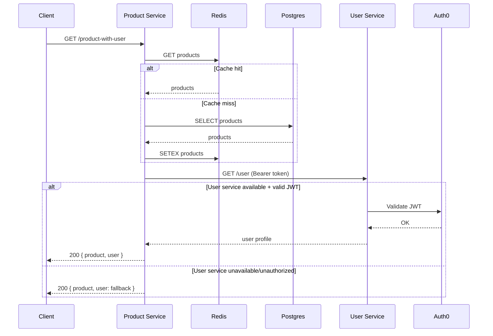

# Narrative Report - Technology Decisions

**Student:** Ali Mustafa (2110097)  
**Module:** Cloud Computing DevOps

## Introduction

For this assignment, I built about 20% of the ThAmCo e-commerce system, focusing on product browsing/search and user authentication/profile management (including an account deletion request). This report explains the technology choices I made and why.

## Technology Decisions

### 1. Why Microservices?

I split the system into separate services (Product Service, User Service) instead of one big application.

**Why I did this:**

- If one service crashes, the others keep working
- I can update one service without touching the others
- Matches what the assignment asked for (cloud-capable, resilient)

**The downside:**

- More complicated to set up and deploy
- Need Docker/container knowledge
- Services need to talk to each other over the network

### 2. Why Node.js?

I used Node.js for both backend services.

**Reasons:**

- Fast for handling lots of requests (good for product browsing)
- Same language as React frontend (JavaScript everywhere)
- Lots of npm packages available
- I'm comfortable with it

### 3. Why PostgreSQL and Redis?

**PostgreSQL:**

- Stores product and order data
- Good for data that needs to be accurate (prices, stock)
- Handles relationships well (products → orders → users)

**Redis:**

- Caches product lists to make browsing faster
- Cache TTL is 5 minutes (so the UI can reflect changes regularly)
- Reduces database load

**Note:** Redis is optional in my implementation. If Redis is not configured (or fails to connect), the Product Service still works and just skips caching.

**Trade-off:** Redis adds complexity but makes the app much faster.

### 4. Why Auth0 Instead of Building My Own Login?

**Reasons:**

- Don't have to store passwords (more secure)
- They handle all the security stuff (encryption, tokens, etc.)
- JWT tokens work even if containers restart
- Industry standard approach

**Downside:** Relies on external service, but that's acceptable for this project.

### 5. Account Deletion (Why it’s done server-side)

The brief requires that customers can request account deletion. For this project I implemented deletion of the Auth0 user using the Auth0 Management API.

- The frontend calls a protected endpoint on the User Service.
- The User Service (server-side) uses a machine-to-machine Auth0 app to delete the user.
- The secret stays in the backend as an environment variable/Container App secret (not in the browser).

## DevOps Practices I Used

### Testing

I wrote automated tests that run every time I push code:

- 13 tests for Product Service
- 12 tests for User Service
- GitHub Actions runs them automatically

This catches bugs before they make it to production.

### Security Scanning

I added Trivy to scan for security vulnerabilities in my code and containers. It runs automatically in the pipeline.

### Docker Compose

I used Docker Compose to run everything locally for testing. Same setup works on my machine and in the cloud (just change environment variables).

## How I Made It Resilient

The system needs to keep working even when things go wrong:

**Timeouts:** If User Service doesn't respond in 5 seconds, Product Service continues with fallback data instead of hanging forever.

**Graceful Degradation:** If you can't log in, you can still browse products. The system works in "degraded mode" rather than completely failing.

**Health Checks:** Each service has a `/health` endpoint so Docker knows if it's working properly.

## Consequences of My Decisions

### Good outcomes:

- Services are independent and can be updated separately
- System is more resilient to failures
- Security is handled by Auth0 (experts)
- Easy to test locally with Docker

### Challenges:

- More complex to set up initially
- Need to understand container networking
- Auth0 dependency (but acceptable trade-off)
- Slightly more resource-intensive than a monolith

## Conclusion

The system meets the assignment requirements and demonstrates cloud-capable, resilient microservices. The technology choices balance simplicity (for a student project) with real-world practices (Docker, CI/CD, Auth0).

The main lesson: microservices add complexity but provide flexibility and resilience that's worth it for cloud deployments.

## Architecture Summary

```mermaid
graph LR
  F[Frontend (React, 3002)] -->|HTTP/JSON| PS[Product Service (Express, 3000)]
  F -->|HTTP/JSON + Bearer JWT| US[User Service (Express, 3001)]

  PS -->|SQL| PG[(PostgreSQL)]
  PS -->|Cache (optional)| RD[(Redis)]

  US -->|OIDC/JWT validation| AUTH0[Auth0]

  PS -->|Service call (resilience demo)| US
```

### API Flow (Resilience + Security)



### Ports & Environment

- Product Service: port 3000 — `DATABASE_URL`, `REDIS_URL`, `USER_SERVICE_URL`
- User Service: port 3001 — `AUTH0_AUDIENCE`, `AUTH0_ISSUER_BASE_URL`
- Frontend: port 3002 — `REACT_APP_API_URL`
