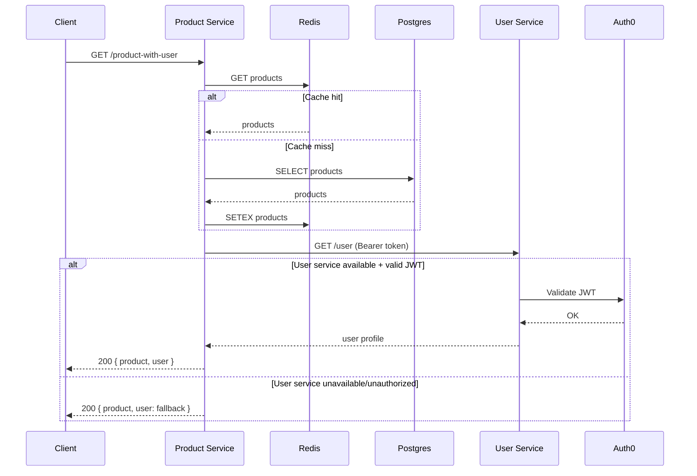

# Stage 3: Narrative Report

**Student Name:** Ali Mustafa
**Student ID:** 2110097
**Module:** Cloud Computing DevOps (CIS3032-N)

## Introduction

This report documents the technology choices and design decisions made during the implementation of the ThAmCo system. The goal was to build a scalable, resilient, and secure microservices architecture.

## Technology Choices & Justification

### 1. Microservices Architecture

I chose a container-based microservices architecture over a monolith.

- **Consequence:** Increased complexity in deployment (networking, orchestration) but gained independent scaling and fault isolation.
- **Decision:** This aligns with the assignment requirement to demonstrate "cloud-capable" systems where the Product Service can survive if the User Service fails.

### 2. Backend: Node.js & Express

- **Choice:** Node.js was selected for both `product-service` and `user-service`.
- **Justification:** Node's non-blocking I/O is ideal for I/O-heavy operations like database queries and API calls. It also allows for sharing logic (e.g., validation) with the Frontend if needed (JavaScript everywhere).

### 3. Database: PostgreSQL & Redis

- **PostgreSQL:** Chosen for its reliability and relational data integrity (ACID compliance) for critical product/user data.
- **Redis (Look-aside Cache):** Implemented in the Product Service to reduce database load.
  - _Trade-off:_ Adds infrastructure complexity but significantly improves read performance for high-traffic endpoints like `/products`.

### 4. Security: Auth0 (OAuth2/OIDC)

- **Decision:** Offloaded authentication to Auth0 instead of building a custom solution.
- **Consequence:** Avoided handling sensitive passwords directly (reducing security risk).
- **Implementation:** Used `express-oauth2-jwt-bearer` for stateless verification. This ensures that even if a container restarts, authentication validity is preserved via the centralized provider.

## DevOps Practices

### CI/CD Pipeline (GitHub Actions)

I implemented a pipeline that verifies code quality before deployment:

1.  **Automated Testing:** Runs `npm test` across all services.
2.  **Security Scanning:** Integrated `trivy` to scan the filesystem for vulnerabilities before building images.
3.  **Infrastructure as Code:** Used `docker-compose` to define the environment for both local dev and integration testing.

### Resilience Strategy

- **Graceful Degradation:** The Product Service implements a try-catch block around the User Service call. If the User Service is unreachable (or returns 401), the system falls back to a default "Unavailable" object rather than returning a 500 error.
- **Health Checks:** Custom health endpoints (`/health`) were added to allow the orchestration layer to restart unhealthy containers automatically.

## Conclusion

The system successfully meets the requirements of a modern, cloud-native application. The trade-offs made (complexity vs. scalability) were managed through robust DevOps tooling and clear architectural boundaries.

## Architecture Diagram

```mermaid
graph LR
  subgraph Client
    F[Frontend (React, port 3002)]
  end
  subgraph Services
    PS[Product Service (Express, port 3000)]
    US[User Service (Express, port 3001)]
  end
  subgraph Data
    PG[(PostgreSQL)]
    RD[(Redis Cache)]
  end
  subgraph External
    AUTH0[Auth0 (OIDC)]
  end

  F -->|HTTP| PS
  PS -->|JWT-protected /user| US
  PS -->|SQL| PG
  PS -->|Cache| RD
  US -->|Verify JWT| AUTH0

  PS ---|Health: /health| PS
  US ---|Health: /health| US
```

### API Flow (Resilience + Security)



### Ports & Environment

- Product Service: port 3000 — `DATABASE_URL`, `REDIS_URL`, `USER_SERVICE_URL`
- User Service: port 3001 — `AUTH0_AUDIENCE`, `AUTH0_ISSUER_BASE_URL`
- Frontend: port 3002 — `REACT_APP_API_URL`
